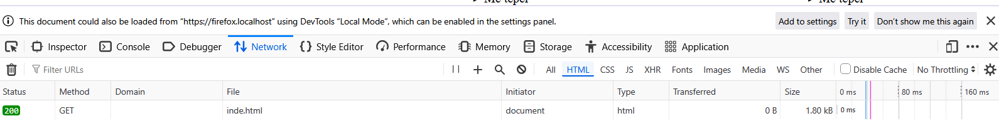

-Jane vendosur tagjet dhe kontenti base, duke perdorur id per te "emeruar" fragmente brenda faqes dhe pastaj
eshte perdorur tagu <a> me link emrin e fragementit perkates;
-Eshte bere lidhja mes fotove;
-Jane perdorur tagjet 
 dhe 
 per te mundesuar fshehjen e nje teksti deri sa perdouresi klikon
-Ne tabin network nuk eshte shfaqur ndonje link i keq
